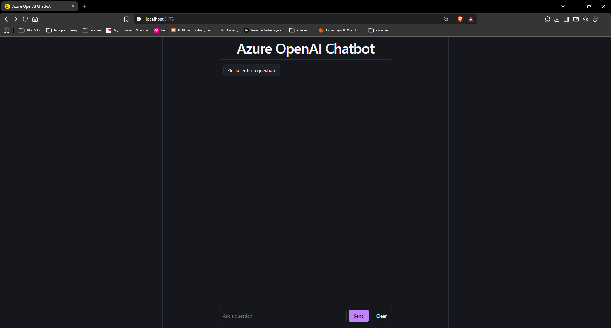
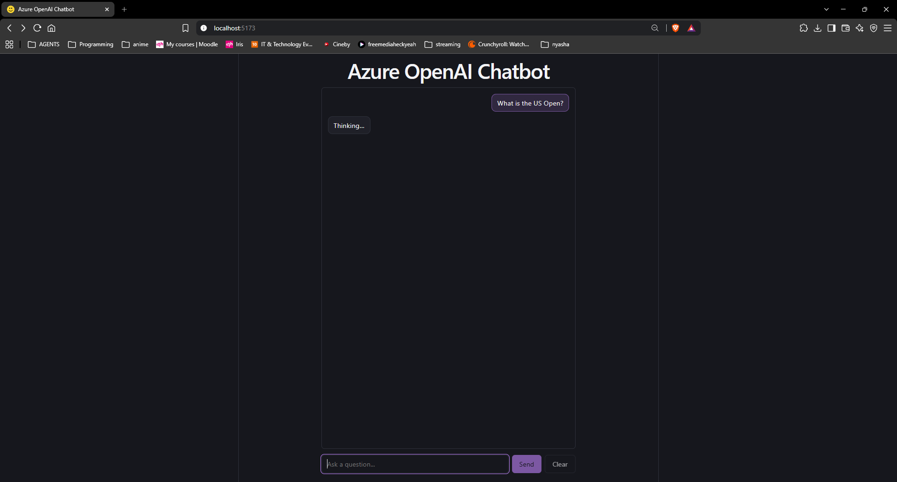

# Azure OpenAI Chatbot

A basic chatbot with a **React** frontend, a **Flask** (Python) backend, and
**Azure OpenAI** generating the answers. Internship test assignment.

You type a question in the browser, the frontend sends it to the backend's
`/query` endpoint, the backend asks Azure OpenAI, and the answer appears in the
chat.

```
React (localhost:5173)  →  Flask /query (localhost:8080)  →  Azure OpenAI
```

## Features

- Input box, **Send** button, and a conversation area (user and bot bubbles)
- Empty input returns "Please ask a question!" (checked on both frontend and backend)
- **Bonus:** "Thinking…" loading message while waiting for the answer
- **Bonus:** **Clear** button that erases the conversation history

## Project structure

```
backend/
  app.py            Flask API — one POST /query endpoint, calls Azure OpenAI
  requirements.txt  Python dependencies
  .env              Azure credentials (you create this — never committed)
  .env.example      Template showing which settings .env needs
frontend/
  src/App.jsx       The whole UI — input, messages and loading state via useState
  src/App.css       Chat styling
```

## Setup

Prerequisites: Python 3.x, Node.js, and an Azure OpenAI resource with a model
deployment.

### 1. Backend

```powershell
cd backend
python -m venv venv
venv\Scripts\Activate.ps1
pip install -r requirements.txt
```

Create a file `backend/.env` with your Azure credentials:

```
AZURE_OPENAI_ENDPOINT=https://your-resource.openai.azure.com/
AZURE_OPENAI_API_KEY=your-key
AZURE_OPENAI_DEPLOYMENT=your-deployment-name
```

(Endpoint and key are under **Keys and Endpoint** on the Azure OpenAI resource;
the deployment name is under **Model deployments**. If any value is missing, the
app tells you which one at startup.)

Start the backend:

```powershell
python app.py
```

Runs on http://localhost:8080.

### 2. Frontend

In a second terminal:

```powershell
cd frontend
npm install
npm run dev
```

Open the URL Vite prints (http://localhost:5173).

## Testing

1. **In the browser** — type a question, click **Send**, and the Azure OpenAI
   answer appears below. While it waits you'll see "Thinking…".
2. **Empty input** — click Send with an empty box: "Please ask a question!"
3. **Backend directly** (Postman or PowerShell) — POST to
   `http://localhost:8080/query` with a raw JSON body:

   ```json
   { "question": "What is Python?" }
   ```

   Response: `{ "answer": "..." }`

## Screenshots & Demo




Full demo video: [screenshots/demo.mp4](screenshots/demo.mp4)

## What I learnt

**Coming from C#/ASP.NET, mapping concepts was the fastest way in.** Flask
routes are controller actions, `request.json` is `[FromBody]`, f-strings are
string interpolation, a venv is roughly a per-project packages folder. I didn't
learn Python from scratch — I translated from what I knew.

**Build order mattered more than I expected.** I built the backend first with a
dummy echo response and tested it in Postman before writing any frontend. That
meant all my UI iterations ran against a free local endpoint, and when I finally
wired in Azure OpenAI, only one thing was new. The integration bug I did hit
(using the model family name instead of the deployment name `gpt-3`) was easy to
isolate because everything else was already proven.

**CORS finally clicked.** The backend worked in Postman but failed from the
browser — because Postman doesn't enforce cross-origin rules and the browser
does. Frontend on :5173 calling :8080 is cross-origin, so the backend has to
opt in via flask-cors.

**Secrets stay out of code and out of git.** Keys live in `.env` (gitignored),
the repo ships `.env.example` as documentation, and the app checks at startup
that all three Azure settings exist — so a missing config fails with a clear
message instead of a stack trace.

**Right-sized beats feature-rich.** At one point the project had env-per-stage
config and locked-down CORS origins (courtesy of AI tooling suggestions). I
reverted them: for a localhost assignment, that's added failure modes with no
benefit. Keeping scope matched to the requirement was a deliberate choice, not
a shortcut.

**React state basics** — `useState` for input/messages/loading, controlled
inputs, rendering the conversation with `.map()`, and functional updates
(`setMessages(prev => ...)`) so appends never race a stale value.
